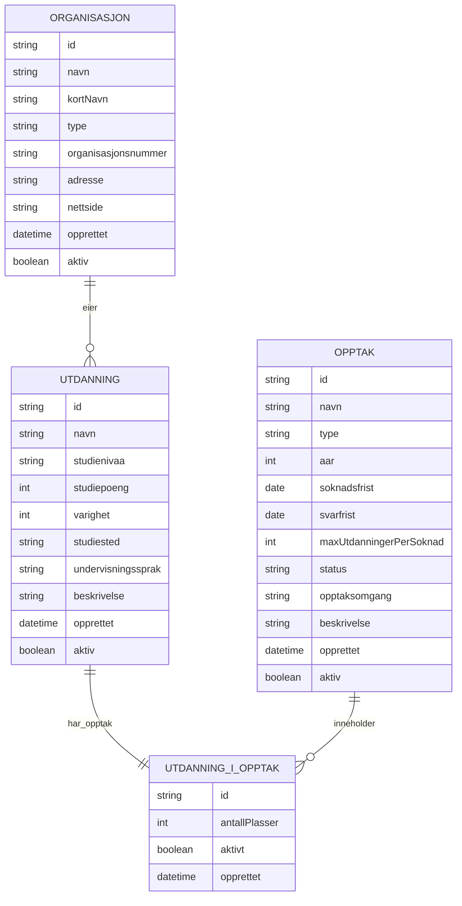

# Entity Map - Opptak

## Entitetsdiagram

## Relasjonsbeskrivelser

### Organisasjon EIER Utdanning
**Kardinalitet**: En-til-mange (1:N)
- En organisasjon kan eie mange utdanninger
- En utdanning eies av nøyaktig én organisasjon
- Eksempel: NTNU eier "Bachelor i informatikk H25", "Master i AI H25", etc.

### Utdanning TILBYS_I Opptak
**Kardinalitet**: Mange-til-en (N:1)
- Hver utdanning tilbys i nøyaktig ett opptak
- Et opptak kan tilby mange utdanninger
- Eksempel: "Bachelor i informatikk H25" og "Master i AI H25" tilbys begge i "Samordnet opptak H25"

**Metadata på relasjonen:**
- Antall studieplasser som er tilgjengelig for utdanningen i dette opptaket
- Om utdanningen er aktiv i opptaket (kan midlertidig deaktiveres)

