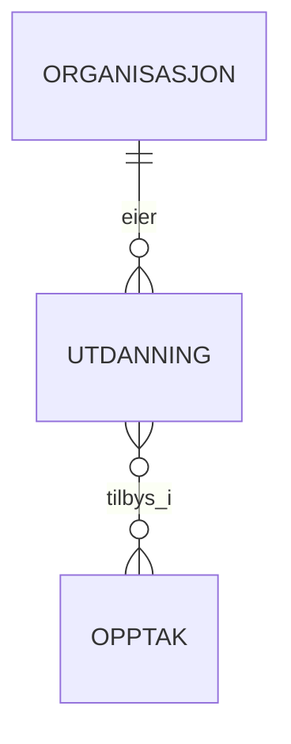

# Entity Map - Opptak

## Entitetsbeskrivelser

### ORGANISASJON
Utdanningsinstitusjoner som tilbyr utdanninger. Kan være universiteter, høgskoler, fagskoler eller private institusjoner.

**Nøkkelfelter:** navn, kortNavn, type, organisasjonsnummer
**Eksempler:** NTNU, UiO, HVL, BI

### UTDANNING  
Konkrete utdanningstilbud med spesifikke detaljer om studienivå, varighet og innhold.

**Nøkkelfelter:** navn, studienivaa, studiepoeng, varighet, studiested
**Eksempler:** "Bachelor i informatikk", "Master i AI", "Sykepleie"

### OPPTAK
Koordinerte opptaksperioder hvor utdanninger samles og søkere kan søke på flere utdanninger samtidig.

**Nøkkelfelter:** navn, type, år, søknadsfrister, maksAntallUtdanninger
**Eksempler:** "Samordnet opptak H25", "FSU V26", "NTNU Lokalt opptak"

## Entitetsdiagram

## Relasjonsbeskrivelser

### Organisasjon EIER Utdanning
**Kardinalitet**: En-til-mange (1:N)
- En organisasjon kan eie mange utdanninger
- En utdanning eies av nøyaktig én organisasjon
- Eksempel: NTNU eier "Bachelor i informatikk H25", "Master i AI H25", etc.

### Utdanning TILBYS_I Opptak  
**Kardinalitet**: Mange-til-mange (M:N)
**Implementasjon**: Koblingstabell `UTDANNING_I_OPPTAK`
- En utdanning kan tilbys i flere opptak
- Et opptak kan inneholde mange utdanninger
- Eksempel: "Bachelor i informatikk" tilbys både i "Samordnet opptak H25" og "NTNU lokalt opptak"
- Eksempel: "Samordnet opptak H25" inneholder både "Bachelor i informatikk" og "Master i AI"

**Metadata på relasjonen:**
- Antall studieplasser tilgjengelig
- Om utdanningen er aktiv i opptaket

