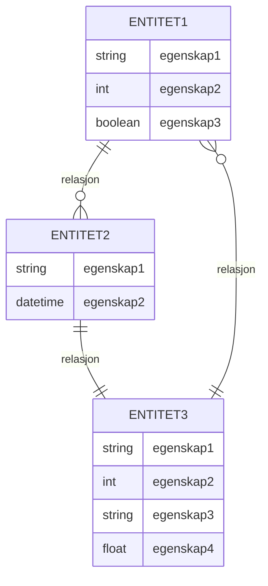

# Entity Map - [Modulnavn]

## Entitetsdiagram

```mermaid
erDiagram
    ENTITET1 {
        string egenskap1
        int egenskap2
        boolean egenskap3
    }
    
    ENTITET2 {
        string egenskap1
        datetime egenskap2
    }
    
    ENTITET3 {
        string egenskap1
        int egenskap2
        string egenskap3
        float egenskap4
    }
    
    ENTITET1 ||--o{ ENTITET2 : "relasjon"
    ENTITET2 ||--|| ENTITET3 : "relasjon"
    ENTITET1 }o--|| ENTITET3 : "relasjon"
```