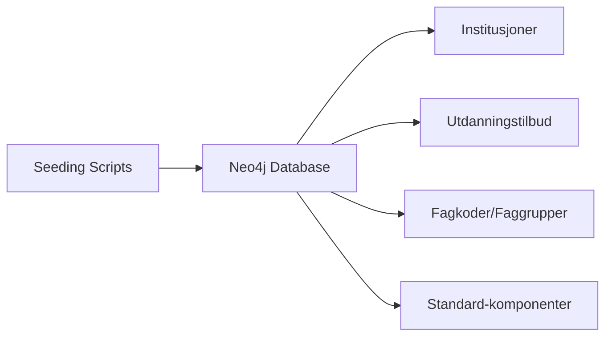
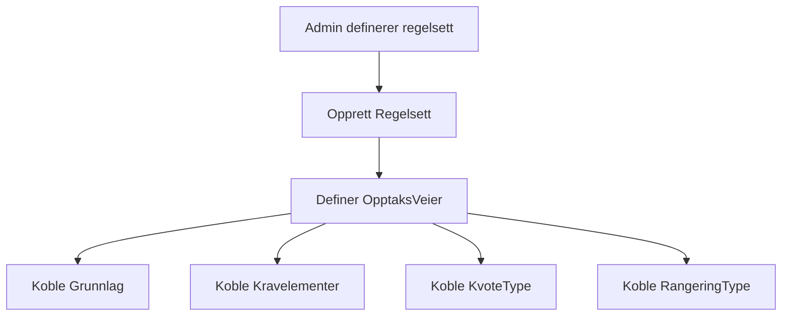
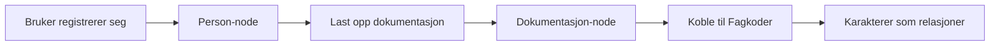

# 🔄 Dataflyt - GrafOpptak

## 📌 Oversikt

Dette dokumentet beskriver hvordan data flyter gjennom GrafOpptak-systemet, fra registrering til opptak. Det viser de viktigste prosessene og hvordan data transformeres og brukes.

## 🌊 Hovedflyter

### 1. Grunndata-etablering



**Prosess**:

1. `seed-all.ts` kjører ved oppstart
2. Oppretter institusjoner med lokasjonsdata
3. Oppretter utdanningstilbud koblet til institusjoner
4. Laster inn fagkoder og faggrupper
5. Etablerer standard-komponenter (Grunnlag, Kravelement, etc.)

### 2. Regelsett-definisjon



**Dataflyt**:

1. Admin oppretter regelsett for utdanningstilbud
2. Definerer hver OpptaksVei med sine komponenter
3. Lagres som graf-struktur i Neo4j
4. Tilgjengelig for evaluering

### 3. Brukerregistrering og dokumentasjon



**Implementert flyt**:

1. Person opprettes med grunndata
2. Dokumentasjon lastes opp og kategoriseres
3. Fagkoder ekstraheres fra vitnemål/karakterutskrift
4. Karakterer lagres som relasjoner med metadata

## 📊 Detaljerte prosesser

### Karakterregistrering

```
Bruker laster opp vitnemål
    ↓
System identifiserer dokumenttype
    ↓
For hver karakter i dokumentet:
    - Finn matchende Fagkode
    - Opprett INNEHOLDER-relasjon
    - Lagre karakter, dato, system
    ↓
Karakterhistorikk etablert
```

**Datastruktur**:

```cypher
(Dokumentasjon)-[:INNEHOLDER {
    karakter: "5",
    karaktersystem: "1-6",
    dato: date("2023-06-15")
}]->(Fagkode)
```

### Kvalifiseringssjekk

```
Søker velger utdanningstilbud
    ↓
Hent alle OpptaksVeier for tilbudet
    ↓
For hver OpptaksVei:
    1. Sjekk grunnlag
    2. Evaluer kravelementer
    3. Hvis kvalifisert → legg til mulige veier
    ↓
Returner kvalifiserende veier
```

**Query-flyt**:

1. Start fra Person
2. Traverser til Dokumentasjon
3. Sjekk mot OpptaksVei-krav
4. Returner matches

### Rangeringsberegning

```
For kvalifisert søker:
    ↓
Hent RangeringType fra OpptaksVei
    ↓
Beregn poeng basert på type:
    - Karaktersnitt
    - Realfagspoeng
    - Alderspoeng
    - Fagbrevpoeng
    ↓
Lagre konkurransepoeng
```

## 🔀 API-dataflyt

### Dashboard API (`/api/dashboard/stats`)

```
Request →
    Query: Antall noder per type →
        Response: {
            institutions: 5,
            utdanningstilbud: 23,
            personer: 150,
            regelsett: 18
        }
```

### Institusjoner API (`/api/institutions`)

```
GET /api/institutions →
    Query: Alle institusjoner med relasjoner →
        Transform: Berik med lokasjon og tilbud →
            Response: Array av institusjoner med metadata
```

### Regelsett API (`/api/regelsett`)

```
GET /api/regelsett/:id →
    Query: Regelsett med alle OpptaksVeier →
        Ekspander: Grunnlag, Krav, Kvote, Rangering →
            Response: Komplett beslutningstre
```

### Evaluering API (`/api/evaluate`)

```
POST /api/evaluate
Body: { personId, utdanningstilbudId } →
    Process:
        1. Hent person med dokumentasjon
        2. Hent utdanningstilbud med regelsett
        3. Evaluer hver OpptaksVei
        4. Beregn rangering for kvalifiserte
    →
    Response: {
        kvalifisert: true/false,
        opptaksveier: [...],
        konkurransepoeng: {...}
    }
```

## 🗄️ Database-interaksjoner

### Les-operasjoner (READ)

**Hyppige queries**:

1. Hent alle utdanningstilbud for institusjon
2. Finn personer med spesifikk dokumentasjon
3. List fagkoder i faggruppe
4. Hent komplett regelsett

**Optimalisering**:

- Indekser på `id` for alle noder
- Sammensatte queries for færre rundturer
- Projeksjoner for å begrense data

### Skriv-operasjoner (WRITE)

**Typiske operasjoner**:

1. Opprett person med dokumentasjon (transaksjon)
2. Legg til karakterer (bulk)
3. Opprett regelsett med OpptaksVeier (nested)

**Transaksjoner**:

```cypher
// Eksempel: Opprett person med dokumentasjon
CALL apoc.cypher.runWrite('
    CREATE (p:Person { ... })
    CREATE (d:Dokumentasjon { ... })
    CREATE (p)-[:EIER]->(d)
    RETURN p, d
')
```

## 🔐 Datatilgangskontroll

### Offentlig data

- Institusjoner og lokasjon
- Utdanningstilbud
- Regelsett og opptakskrav
- Generell statistikk

### Beskyttet data

- Personinformasjon
- Dokumentasjon og karakterer
- Søknader og prioriteringer

### Admin-data

- Systemkonfiguration
- Brukeradministrasjon
- Detaljert statistikk

## 📈 Dataflyt-optimalisering

### Caching-strategi

```
Statisk data (institusjoner, fagkoder):
    → Cache i 24 timer

Semi-statisk (regelsett, tilbud):
    → Cache i 1 time

Dynamisk (personer, søknader):
    → Ingen cache / kort TTL
```

### Batch-operasjoner

```
Karakterimport:
    → Samle alle karakterer
    → Validere mot fagkoder
    → Bulk-insert med UNWIND

Regelsettkopi:
    → Deep clone med Cypher
    → Bevare struktur
    → Atomisk operasjon
```

## 🚨 Feilhåndtering i dataflyt

### Valideringslag

```
Input →
    Skjemavalidering (Zod) →
        Forretningsvalidering →
            Database constraints →
                Respons
```

### Feiltyper og håndtering

**Valideringsfeil**:

- Returnér 400 med detaljer
- Logg ikke (forventet)

**Integritetsbrudd**:

- Returnér 409 Conflict
- Logg med kontekst

**Systemfeil**:

- Returnér 500
- Logg full stack trace
- Varsle admin

## 🔄 Hendelsesflyt (Event flow)

### Opptaksprosess (fremtidig)

```
Søknadsfrist passert →
    Trigger: Start evaluering →
        For hver søknad:
            - Evaluer kvalifikasjon
            - Beregn poeng
            - Plasser i køer
        →
        Ranger innen kvoter →
            Generer tilbud →
                Send varslinger
```

### Karakteroppdatering

```
Ny karakter registrert →
    Oppdater karaktersnitt →
        Re-evaluer kvalifikasjoner →
            Oppdater rangeringer →
                Varsle hvis endringer
```

## 📊 Dataflyt-eksempler

### Eksempel 1: Finn kvalifiserte utdanningstilbud

```
Bruker (Person-id: "123")
    ↓
Hent dokumentasjon og fagkoder
    ↓
For hvert utdanningstilbud:
    - Hent regelsett
    - Sjekk hver OpptaksVei
    - Samle kvalifiserte
    ↓
Returner sortert liste
```

### Eksempel 2: Opprett komplett søknad

```
Input: Søknadsdata
    ↓
Valider person eksisterer
    ↓
Opprett Søknad-node
    ↓
Koble til Person (SØKER_MED)
    ↓
Koble til Opptak (GJELDER)
    ↓
For hver prioritet:
    Koble til Utdanningstilbud
    ↓
Returner komplett søknad
```

## 🎯 Ytelseshensyn

### Query-optimalisering

- Bruk indekser effektivt
- Begrens dybde på traversering
- Projekter kun nødvendige felter

### Bulk-operasjoner

- UNWIND for mange noder
- Batch creates/updates
- Transaksjoner for konsistens

### Monitoring

- Spor query-tider
- Overvåk database-størrelse
- Varsle ved treghet
