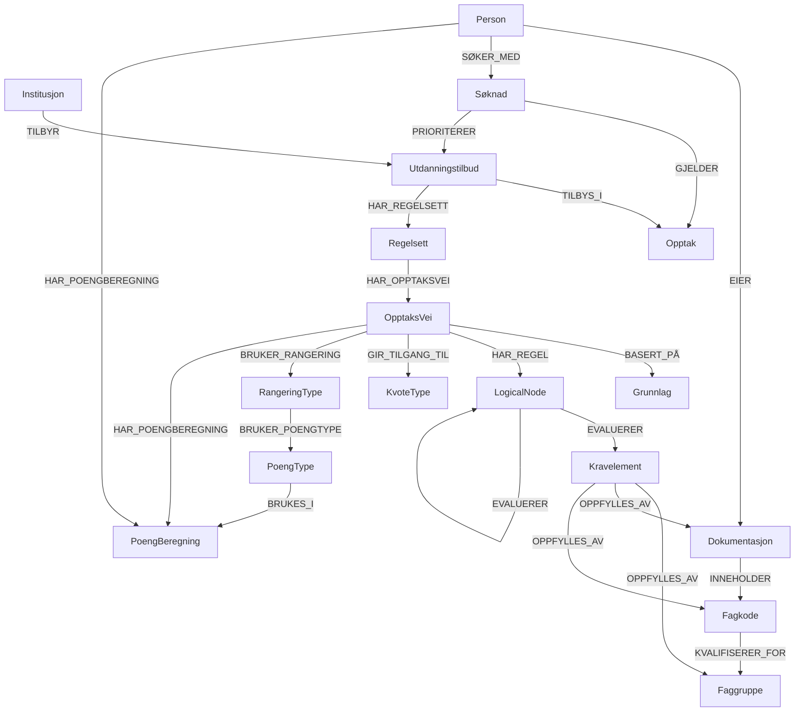

# 🗄️ Neo4j Datamodell - Opptakssystem

## 📊 Oversikt



## 🏷️ Node-typer

### 🏫 Institusjon

**Node label:** `Institusjon`

**Properties:**

- `id` (string, required, unique): Unik identifikator (f.eks. "ntnu", "uio")
- `navn` (string, required): Fullt navn (f.eks. "Norges teknisk-naturvitenskapelige universitet")
- `kortNavn` (string): Kort navn/akronym (f.eks. "NTNU")
- `type` (string): Type institusjon ("universitet", "høgskole", "fagskole", "privat")
- `institusjonsnummer` (string): Offisielt institusjonsnummer fra DBH
- `adresse` (string): Hovedadresse
- `nettside` (string): URL til hovedside
- `opprettet` (datetime): Når institusjonen ble opprettet i systemet
- `aktiv` (boolean): Om institusjonen er aktiv

**Constraints:**

```cypher
CREATE CONSTRAINT institusjon_id FOR (i:Institusjon) REQUIRE i.id IS UNIQUE;
CREATE CONSTRAINT institusjon_institusjonsnummer FOR (i:Institusjon) REQUIRE i.institusjonsnummer IS UNIQUE;
```

### 🎓 Utdanningstilbud

**Node label:** `Utdanningstilbud`

**Properties:**

- `id` (string, required, unique): Unik identifikator (f.eks. "ntnu-sykepleie-h25")
- `navn` (string, required): Navn på tilbudet (f.eks. "Bachelor i sykepleie")
- `studienivaa` (string): "bachelor", "master", "phd", "fagskole", "videreutdanning"
- `studiepoeng` (integer): Antall studiepoeng (f.eks. 180, 120)
- `varighet` (integer): Varighet i semestre
- `semester` (string): "host" eller "var"
- `aar` (integer): Oppstartsår (f.eks. 2025)
- `studiested` (string): Hvor studiet gjennomføres (f.eks. "Trondheim", "Gjøvik")
- `undervisningssprak` (string): "norsk", "engelsk", "begge"
- `maxAntallStudenter` (integer): Maks antall studieplasser
- `beskrivelse` (string): Utfyllende beskrivelse av studiet
- `opprettet` (datetime): Når tilbudet ble opprettet
- `aktiv` (boolean): Om tilbudet er aktivt

**Constraints:**

```cypher
CREATE CONSTRAINT utdanningstilbud_id FOR (u:Utdanningstilbud) REQUIRE u.id IS UNIQUE;
```

### 👤 Person

**Node label:** `Person`

**Properties:**

- `id` (string, required, unique): Unik identifikator (f.eks. UUID eller fødselsnummer-hash)
- `fornavn` (string, required): Fornavn
- `etternavn` (string, required): Etternavn
- `fodselsdato` (date, required): Fødselsdato
- `fodselsnummer` (string, required, unique): Fødselsnummer (kryptert/hashet)
- `epost` (string, required): E-postadresse
- `telefon` (string): Telefonnummer
- `adresse` (string): Bostedsadresse
- `postnummer` (string): Postnummer
- `poststed` (string): Poststed
- `statsborgerskap` (string): Statsborgerskap (f.eks. "norsk", "svensk")
- `opprettet` (datetime): Når personen ble registrert i systemet
- `aktiv` (boolean): Om personen er aktiv

**Constraints:**

```cypher
CREATE CONSTRAINT person_id FOR (p:Person) REQUIRE p.id IS UNIQUE;
CREATE CONSTRAINT person_fodselsnummer FOR (p:Person) REQUIRE p.fodselsnummer IS UNIQUE;
CREATE CONSTRAINT person_epost FOR (p:Person) REQUIRE p.epost IS UNIQUE;
```

### 📄 Dokumentasjon

**Node label:** `Dokumentasjon`

**Properties:**

- `id` (string, required, unique): Unik identifikator (f.eks. UUID)
- `type` (string, required): Type dokument
  - Primærtyper med karakterer: "vitnemaal", "fagbrev", "karakterutskrift"
  - Andre typer: "spraaktest", "militaerattest", "politiattest", "annet"
- `navn` (string, required): Beskrivende navn (f.eks. "Vitnemål videregående skole")
- `utstedt` (date): Dato dokumentet ble utstedt
- `utsteder` (string): Hvem som utstedte dokumentet (f.eks. "Oslo katedralskole", "NTNU", "Fagopplæring i Viken")
- `utdanningsnivaa` (string): Nivå for karakterdokumenter ("videregående", "høyere utdanning", "fagopplæring")
- `gyldigTil` (date): Utløpsdato (hvis relevant, f.eks. språktester, politiattest)
- `opprettet` (datetime): Når dokumentet ble registrert
- `aktiv` (boolean): Om dokumentet er aktivt

**Constraints:**

```cypher
CREATE CONSTRAINT dokumentasjon_id FOR (d:Dokumentasjon) REQUIRE d.id IS UNIQUE;
```

### 🎯 Opptak

**Node label:** `Opptak`

**Properties:**

- `id` (string, required, unique): Unik identifikator (f.eks. "samordnet-h25")
- `navn` (string, required): Navn på opptaket (f.eks. "Samordnet opptak høst 2025")
- `type` (string, required): Type opptak ("samordnet", "lokalt", "direkte")
- `aar` (integer, required): År (f.eks. 2025)
- `soknadsfrist` (date): Søknadsfrist
- `svarfrist` (date): Frist for å svare på tilbud
- `maxSoknaderPerPerson` (integer): Maks antall søknader per person
- `status` (string): Status ("fremtidig", "apent", "stengt", "avsluttet")
- `opptaksomgang` (string): "hovedomgang", "tilleggsomgang", "lopende"
- `beskrivelse` (string): Beskrivelse av opptaket
- `opprettet` (datetime): Når opptaket ble opprettet
- `aktiv` (boolean): Om opptaket er aktivt

**Constraints:**

```cypher
CREATE CONSTRAINT opptak_id FOR (o:Opptak) REQUIRE o.id IS UNIQUE;
```

### 📝 Søknad

**Node label:** `Søknad`

**Properties:**

- `id` (string, required, unique): Unik identifikator (f.eks. UUID)
- `status` (string, required): Status ("utkast", "sendt", "behandlet", "avsluttet")
- `opprettet` (datetime): Når søknaden ble opprettet
- `sistEndret` (datetime): Sist endret
- `sendtInn` (datetime): Når søknaden ble sendt inn
- `kommentar` (string): Søkerens kommentarer/tilleggsinfo
- `aktiv` (boolean): Om søknaden er aktiv

**Constraints:**

```cypher
CREATE CONSTRAINT soknad_id FOR (s:Søknad) REQUIRE s.id IS UNIQUE;
```

### 📜 Regelsett

**Node label:** `Regelsett`

**Properties:**

- `id` (string, required, unique): Unik identifikator (f.eks. "ntnu-sykepleie-h25-regelsett")
- `navn` (string, required): Navn på regelsettet (f.eks. "Regelsett for Bachelor i sykepleie")
- `versjon` (string): Versjon (f.eks. "1.0", "2.1")
- `erMal` (boolean): Om dette er et mal-regelsett som andre kan basere seg på
- `malType` (string): Type mal hvis erMal=true (f.eks. "ingeniørutdanning", "lærerutdanning")
- `basertPå` (string): ID til mal-regelsett dette er basert på (hvis relevant)
- `gyldigFra` (date): Fra hvilken dato regelsettet gjelder
- `gyldigTil` (date, optional): Til hvilken dato (hvis midlertidig)
- `beskrivelse` (string): Beskrivelse av regelsettet
- `opprettet` (datetime): Når regelsettet ble opprettet
- `aktiv` (boolean): Om regelsettet er aktivt

**Constraints:**

```cypher
CREATE CONSTRAINT regelsett_id FOR (r:Regelsett) REQUIRE r.id IS UNIQUE;
```

### 🛣️ OpptaksVei

**Node label:** `OpptaksVei`

**Properties:**

- `id` (string, required, unique): Unik identifikator (f.eks. "forstegangsvitnemaal-ntnu-bygg-h25")
- `navn` (string, required): Navn på opptaksveien (f.eks. "Førstegangsvitnemål - NTNU Bygg H25")
- `beskrivelse` (string): Beskrivelse av opptaksveien
- `aktiv` (boolean): Om opptaksveien er aktiv
- `opprettet` (datetime): Når opptaksveien ble opprettet

**Beskrivelse:** En OpptaksVei representerer en komplett regel i et beslutningstre - fra grunnlag via krav til kvote og rangering. Hver vei definerer én måte en søker kan kvalifisere for opptak.

**Constraints:**

```cypher
CREATE CONSTRAINT opptaksvei_id FOR (ov:OpptaksVei) REQUIRE ov.id IS UNIQUE;
```

### 🏗️ Grunnlag (Standard)

**Node label:** `Grunnlag`

**Properties:**

- `id` (string, required, unique): Unik identifikator
- `navn` (string, required): Navn på grunnlaget (f.eks. "Vitnemål videregående")
- `type` (string, required): Type grunnlag ("forstegangsvitnemaal-vgs", "ordinaert-vitnemaal-vgs", "fagbrev", "fagskole", "utenlandsk", "realkompetanse")
- `beskrivelse` (string): Beskrivelse av grunnlaget
- `aktiv` (boolean): Om grunnlaget er aktivt

**Constraints:**

```cypher
CREATE CONSTRAINT grunnlag_id FOR (g:Grunnlag) REQUIRE g.id IS UNIQUE;
```

### ✅ Kravelement (Standard)

**Node label:** `Kravelement`

**Properties:**

- `id` (string, required, unique): Unik identifikator
- `navn` (string, required): Navn på kravelementet (f.eks. "Generell studiekompetanse")
- `type` (string, required): Type krav ("gsk", "matematikk-r1", "matematikk-r2", "alder", "alder-forstegangsvitnemaal", "erfaring", "språk")
- `beskrivelse` (string): Detaljert beskrivelse
- `aktiv` (boolean): Om kravelementet er aktivt

**Constraints:**

```cypher
CREATE CONSTRAINT kravelement_id FOR (ke:Kravelement) REQUIRE ke.id IS UNIQUE;
```

### 🧠 LogicalNode (Boolean Logikk)

**Node label:** `LogicalNode`

**Properties:**

- `id` (string, required, unique): Unik identifikator
- `navn` (string, required): Beskrivende navn for regelen (f.eks. "UiO Informatikk Grunnkrav")
- `type` (string, required): Logisk operasjon ("AND", "OR", "NOT")
- `beskrivelse` (string): Forklaring av regelens formål
- `aktiv` (boolean): Om regelen er aktiv
- `opprettet` (datetime): Når regelen ble opprettet

**Beskrivelse:** LogicalNode implementerer boolean logikk for komplekse opptakskrav. Følger Neo4j beste praksiser for regel-motorer ved å separere logikk fra data.

**Constraints:**

```cypher
CREATE CONSTRAINT logicalnode_id FOR (ln:LogicalNode) REQUIRE ln.id IS UNIQUE;
```

### 📊 KvoteType (Standard)

**Node label:** `KvoteType`

**Properties:**

- `id` (string, required, unique): Unik identifikator
- `navn` (string, required): Navn på kvotetypen (f.eks. "Ordinær kvote")
- `type` (string, required): Type kvote ("ordinaer", "forstegangsvitnemaal", "forkurs", "internasjonal")
- `beskrivelse` (string): Beskrivelse av kvotetypen
- `aktiv` (boolean): Om kvotetypen er aktiv

**Constraints:**

```cypher
CREATE CONSTRAINT kvotetype_id FOR (kt:KvoteType) REQUIRE kt.id IS UNIQUE;
```

### 📈 RangeringType (Standard)

**Node label:** `RangeringType`

**Properties:**

- `id` (string, required, unique): Unik identifikator
- `navn` (string, required): Navn på rangeringstypen (f.eks. "Karaktersnitt + realfagspoeng")
- `type` (string, required): Type rangering ("karaktersnitt", "fagbrev", "arbeidserfaring", "kombinert")
- `formelMal` (string): Mal for rangeringsformelen
- `beskrivelse` (string): Detaljert beskrivelse
- `aktiv` (boolean): Om rangeringstypen er aktiv

**Constraints:**

```cypher
CREATE CONSTRAINT rangeringtype_id FOR (rt:RangeringType) REQUIRE rt.id IS UNIQUE;
```

### 📊 PoengType (Standard)

**Node label:** `PoengType`

**Properties:**

- `id` (string, required, unique): Unik identifikator
- `navn` (string, required): Navn på poengtypen (f.eks. "karaktersnitt-vitnemaal", "realfagspoeng")
- `type` (string, required): Type poeng ("dokumentbasert", "tilleggspoeng", "manuell")
- `beskrivelse` (string): Detaljert beskrivelse av hvordan poengene beregnes
- `beregningsmåte` (string): Tekstbeskrivelse av beregningsmåte (f.eks. "Snitt av alle karakterer på vitnemål \* 10")
- `aktiv` (boolean): Om poengtypen er aktiv
- `opprettet` (datetime): Når poengtypen ble opprettet

**Constraints:**

```cypher
CREATE CONSTRAINT poengtype_id FOR (pt:PoengType) REQUIRE pt.id IS UNIQUE;
```

### 🎯 PoengBeregning

**Node label:** `PoengBeregning`

**Properties:**

- `id` (string, required, unique): Unik identifikator
- `personId` (string, required): Referanse til person
- `opptaksVeiId` (string, required): Referanse til opptaksvei
- `poengTypeId` (string, required): Referanse til poengtype
- `verdi` (float, required): Beregnet poengverdi (f.eks. 44.2)
- `grunnlag` (string): Beskrivelse av grunnlaget (f.eks. "vitnemaal-id-123", "dokument-456")
- `beregnetDato` (datetime, required): Når poengene ble beregnet
- `gyldig` (boolean): Om beregningen er gyldig
- `kommentar` (string): Eventuell kommentar til beregningen

**Constraints:**

```cypher
CREATE CONSTRAINT poengberegning_id FOR (pb:PoengBeregning) REQUIRE pb.id IS UNIQUE;
CREATE CONSTRAINT poengberegning_unique FOR (pb:PoengBeregning) REQUIRE (pb.personId, pb.opptaksVeiId, pb.poengTypeId) IS UNIQUE;
```

**Relationships:**

```cypher
// PoengBeregning knyttet til Person, OpptaksVei og PoengType
MATCH (pb:PoengBeregning), (p:Person), (ov:OpptaksVei), (pt:PoengType)
WHERE pb.personId = p.id AND pb.opptaksVeiId = ov.id AND pb.poengTypeId = pt.id
CREATE (pb)-[:GJELDER_PERSON]->(p)
CREATE (pb)-[:GJELDER_OPPTAKSVEI]->(ov)
CREATE (pb)-[:BRUKER_POENGTYPE]->(pt)
```

### 📚 Fagkode

**Node label:** `Fagkode`

**Properties:**

- `id` (string, required, unique): Unik identifikator
- `kode` (string, required): Fagkoden (f.eks. "MAT1001-S1", "3MX", "REA3")
- `navn` (string, required): Navn på faget
- `beskrivelse` (string): Beskrivelse av faget
- `gyldigFra` (date): Fra hvilken dato fagkoden var/er gyldig
- `gyldigTil` (date): Til hvilken dato (hvis utfaset)
- `aktiv` (boolean): Om fagkoden er aktiv

**Constraints:**

```cypher
CREATE CONSTRAINT fagkode_id FOR (fk:Fagkode) REQUIRE fk.id IS UNIQUE;
CREATE CONSTRAINT fagkode_kode FOR (fk:Fagkode) REQUIRE fk.kode IS UNIQUE;
```

### 🎯 Faggruppe

**Node label:** `Faggruppe`

**Properties:**

- `id` (string, required, unique): Unik identifikator
- `navn` (string, required): Navn på faggruppen (f.eks. "Matematikk R1-nivå")
- `beskrivelse` (string): Beskrivelse av hva som kreves
- `type` (string): Type faggruppe ("matematikk", "norsk", "naturfag", etc.)
- `aktiv` (boolean): Om faggruppen er aktiv

**Constraints:**

```cypher
CREATE CONSTRAINT faggruppe_id FOR (fg:Faggruppe) REQUIRE fg.id IS UNIQUE;
```

## 📝 Eksempel: Kravelementer med forskjellige oppfyllelsesmåter

### Eksempel 1: Matematikk R1-nivå (via faggruppe)

**Fagkoder:**

```cypher
CREATE (s1:Fagkode {
  id: "mat-s1",
  kode: "MAT1001-S1",
  navn: "Matematikk S1",
  aktiv: true
});

CREATE (s2:Fagkode {
  id: "mat-s2",
  kode: "MAT1002-S2",
  navn: "Matematikk S2",
  aktiv: true
});

CREATE (r1:Fagkode {
  id: "mat-r1",
  kode: "MAT1014-R1",
  navn: "Matematikk R1",
  aktiv: true
});
```

**Faggruppe:**

```cypher
CREATE (fg:Faggruppe {
  id: "matematikk-r1-nivaa",
  navn: "Matematikk R1-nivå",
  type: "matematikk",
  beskrivelse: "Matematikk på R1-nivå eller tilsvarende",
  aktiv: true
});
```

**Kravelement som oppfylles av faggruppe:**

```cypher
CREATE (krav_matte:Kravelement {
  id: "krav-matematikk-r1",
  navn: "Matematikk R1-nivå",
  type: "matematikk-r1",
  beskrivelse: "Matematikk på R1-nivå eller tilsvarende",
  aktiv: true
});

// Kravelementet oppfylles av faggruppen
CREATE (krav_matte)-[:OPPFYLLES_AV]->(fg);
```

**Kvalifisering:**

```cypher
// Direkte kvalifisering
CREATE (r1)-[:KVALIFISERER_FOR]->(fg);

// Kombinasjonskrav (krever begge S1 og S2)
CREATE (s1)-[:KVALIFISERER_FOR {kreverKombinasjon: ["MAT1002-S2"]}]->(fg);
CREATE (s2)-[:KVALIFISERER_FOR {kreverKombinasjon: ["MAT1001-S1"]}]->(fg);
```

### Eksempel 2: Politiattest (direkte dokumentasjon)

```cypher
CREATE (krav_politiattest:Kravelement {
  id: "krav-politiattest",
  navn: "Politiattest",
  type: "politiattest",
  beskrivelse: "Gyldig politiattest ikke eldre enn 3 måneder",
  aktiv: true
});

// Kravelementet oppfylles direkte av dokumentasjonstype
CREATE (krav_politiattest)-[:OPPFYLLES_AV {dokumentType: "politiattest", maksAlder: "3 måneder"}]->(:Dokumentasjon);
```

### Eksempel 3: Spesifikk fagkode (direkte fagkode)

```cypher
CREATE (spesiell_fagkode:Fagkode {
  id: "spesiell-fag",
  kode: "SPEC001",
  navn: "Spesialisert fag",
  aktiv: true
});

CREATE (krav_spesiell:Kravelement {
  id: "krav-spesiell-fagkode",
  navn: "Spesialisert fagkompetanse",
  type: "spesiell-fagkode",
  beskrivelse: "Krever akkurat dette spesielle faget",
  aktiv: true
});

// Kravelementet oppfylles direkte av en spesifikk fagkode
CREATE (krav_spesiell)-[:OPPFYLLES_AV]->(spesiell_fagkode);
```

**Dokumentasjon med fagkoder og karakterer:**

```cypher
CREATE (vitnemal:Dokumentasjon {
  id: "ole-vitnemal-vgs",
  navn: "Vitnemål videregående skole",
  type: "vitnemaal"
});

CREATE (karakterutskrift:Dokumentasjon {
  id: "ole-karakterutskrift-ntnu",
  navn: "Karakterutskrift NTNU",
  type: "karakterutskrift"
});

CREATE (fagbrev:Dokumentasjon {
  id: "ole-fagbrev-elektriker",
  navn: "Fagbrev elektriker",
  type: "fagbrev"
});

// Ole har S1 med karakter 5 og S2 med karakter 4 fra ordinær undervisning
CREATE (vitnemal)-[:INNEHOLDER {
  karakter: "5",
  karaktersystem: "1-6",
  dato: date("2023-06-15")
}]->(s1);

CREATE (vitnemal)-[:INNEHOLDER {
  karakter: "4",
  karaktersystem: "1-6",
  dato: date("2023-06-15")
}]->(s2);

// Ole tok S2 på nytt som privatist og forbedret karakteren
CREATE (vitnemal)-[:INNEHOLDER {
  karakter: "5",
  karaktersystem: "1-6",
  dato: date("2024-01-20"),
  kommentar: "privatist forbedring"
}]->(s2);

// Fagbrev med bestått/ikke bestått
CREATE (fagbrev)-[:INNEHOLDER {
  karakter: "bestått",
  karaktersystem: "bestått/ikke bestått",
  dato: date("2022-11-30")
}]->(:Fagkode {kode: "ELE2001"});
```

## 🌳 Regelsett som tre-struktur

Et regelsett bygges opp som en tre-struktur hvor hver OpptaksVei definerer en komplett regel:

1. **Grunnlag** - Hva søker må ha som utgangspunkt
2. **Kravelement** - Spesifikke krav som må oppfylles
3. **KvoteType** - Hvilken kvote søker konkurrerer i
4. **RangeringType** - Hvordan søkere rangeres innenfor kvoten

**Eksempel på beslutningstre med LogicalNode:**

```
📜 Regelsett: "NTNU Bygg- og miljøteknikk H25"

└── 🛣️ OpptaksVei: "Ordinær vei - NTNU Bygg"
    ├── 📋 Grunnlag: Vitnemål videregående
    ├── 🧠 LogicalNode: "NTNU Bygg Grunnkrav" (AND)
    │   ├── 🧠 EVALUERER → "Generell studiekompetanse"
    │   ├── 🧠 EVALUERER → "Fysikk 1"
    │   └── 🧠 EVALUERER → LogicalNode: "Matematikk R1+R2" (AND)
    │       ├── 🧠 EVALUERER → "Matematikk R1"
    │       └── 🧠 EVALUERER → "Matematikk R2"
    ├── 🎯 Kvote: Ordinær kvote
    └── 📊 Rangering: Konkurransepoeng

📜 Regelsett: "UiO Informatikk H25"

└── 🛣️ OpptaksVei: "Ordinær vei - UiO Informatikk"
    ├── 📋 Grunnlag: Vitnemål videregående
    ├── 🧠 LogicalNode: "UiO Informatikk Grunnkrav" (AND)
    │   ├── 🧠 EVALUERER → "Generell studiekompetanse"
    │   └── 🧠 EVALUERER → LogicalNode: "Matematikk R1 eller R2" (OR)
    │       ├── 🧠 EVALUERER → "Matematikk R1"
    │       └── 🧠 EVALUERER → "Matematikk R2"
    ├── 🎯 Kvote: Ordinær kvote
    └── 📊 Rangering: Konkurransepoeng
```

**Regeluttrykk:**
- **NTNU Bygg:** "Generell studiekompetanse OG Fysikk 1 OG (Matematikk R2 OG Matematikk R1)"
- **UiO Informatikk:** "Generell studiekompetanse OG (Matematikk R2 ELLER Matematikk R1)"

## ⚡ Gjenbruk og tilpasning

- **Standard-komponenter** (Grunnlag, Kravelement, KvoteType, RangeringType) kan gjenbrukes på tvers av institusjoner
- Hver OpptaksVei kombinerer standard-komponenter til en spesifikk regel
- Institusjoner kan lage egne standard-komponenter for spesielle behov
- Historikk bevares ved versjonering av komponenter og OpptaksVeier

## 🎯 Karakterhåndtering og historikk

### Karaktersystemer

Systemet støtter to karaktersystemer:

1. **Tallkarakterer (1-6)**: Brukes for videregående skole og høyere utdanning
2. **Bestått/Ikke bestått**: Brukes primært for fagbrev og enkelte høyskolefag

### Historikk og forbedringsforsøk

Systemet støtter full historikk for karakterer:

- Samme person kan ha flere karakterer for samme fagkode
- Dato brukes for å skille mellom ulike forsøk
- Ved opptak brukes normalt beste karakter (nyeste dato ved lik karakter)

### Query-eksempler for karakterer

**Finn beste karakter for en fagkode:**

```cypher
MATCH (p:Person)-[:EIER]->(d:Dokumentasjon)-[r:INNEHOLDER]->(fk:Fagkode {kode: "MAT1002-S2"})
WHERE r.karaktersystem = "1-6"
RETURN p, d, fk, r.karakter, r.dato
ORDER BY toInteger(r.karakter) DESC, r.dato DESC
LIMIT 1;
```

**Finn all karakterhistorikk for en person:**

```cypher
MATCH (p:Person {id: $personId})-[:EIER]->(d:Dokumentasjon)-[r:INNEHOLDER]->(fk:Fagkode)
RETURN d.navn, d.type, fk.kode, fk.navn, r.karakter, r.karaktersystem, r.dato, r.kommentar
ORDER BY r.dato DESC, fk.kode;
```

**Sjekk om person oppfyller karakterkrav:**

```cypher
// Sjekk om person har matematikk R1 med minst karakter 4
MATCH (p:Person {id: $personId})-[:EIER]->(d:Dokumentasjon)-[r:INNEHOLDER]->(fk:Fagkode)
WHERE fk.kode IN ["REA3022", "MAT1001-S1", "MAT1002-S2"] // R1 eller S1+S2
  AND r.karaktersystem = "1-6"
  AND toInteger(r.karakter) >= 4
RETURN count(DISTINCT fk) > 0 as oppfyllerKrav;
```

## 📊 Query-eksempler

**Finn alle utdanningstilbud med mattekrav:**

```cypher
// Via OpptaksVei med LogicalNode-struktur
MATCH (u:Utdanningstilbud)-[:HAR_REGELSETT]->(r:Regelsett)
      -[:HAR_OPPTAKSVEI]->(ov:OpptaksVei)
      -[:HAR_REGEL]->(ln:LogicalNode)
      -[:EVALUERER*]->(ke:Kravelement)
WHERE ke.type CONTAINS "matematikk"
RETURN u;

// Med index for performance
CREATE INDEX kravelement_type FOR (ke:Kravelement) ON (ke.type);

// Kort query med variable path length
MATCH (u:Utdanningstilbud)-[*]-(ke:Kravelement)
WHERE ke.type CONTAINS "matematikk"
RETURN u;
```

**Finn kvalifiserende OpptaksVeier:**

```cypher
// Alle OpptaksVeier som krever Matematikk R2 (via LogicalNode)
MATCH (u:Utdanningstilbud)-[:HAR_REGELSETT]->(r:Regelsett)
      -[:HAR_OPPTAKSVEI]->(ov:OpptaksVei)
      -[:HAR_REGEL]->(ln:LogicalNode)
      -[:EVALUERER*]->(ke:Kravelement)
WHERE ke.type = "matematikk-r2"
RETURN u.navn, ov.navn, ln.navn, ke.navn;
```

**Bygg regeluttrykk for en OpptaksVei:**

```cypher
// Hent hierarkisk LogicalNode struktur for menneskelesbar visning
MATCH (ov:OpptaksVei {id: $opptaksVeiId})-[:HAR_REGEL]->(rootNode:LogicalNode)
CALL apoc.path.subgraphAll(rootNode, {
  relationshipFilter: "EVALUERER>",
  labelFilter: "+LogicalNode|+Kravelement"
}) 
YIELD nodes, relationships
RETURN nodes, relationships;
```

**Fordeler med OpptaksVei-struktur:**

- ✅ Fleksibilitet: Hver vei er selvstendig og kan tilpasses
- ✅ Klarhet: Tydelige regler uten komplekse avhengigheter
- ✅ Performance: Neo4j optimalisert for grafdatatraversering
- ✅ Gjenbruk: Standard-komponenter brukes på tvers av veier

## 🔗 Relationship-typer

### Institusjon TILBYR Utdanningstilbud

**Properties:** (ingen foreløpig)

**Beskrivelse:** En institusjon tilbyr et utdanningstilbud

### Person EIER Dokumentasjon

**Properties:** (ingen)

**Beskrivelse:** En person eier sin dokumentasjon

### Utdanningstilbud TILBYS_I Opptak

**Properties:** (ingen foreløpig)

**Beskrivelse:** Et utdanningstilbud tilbys i et opptak

### Person SØKER_MED Søknad

**Properties:** (ingen)

**Beskrivelse:** En person søker med en søknad

### Søknad GJELDER Opptak

**Properties:** (ingen)

**Beskrivelse:** Søknaden gjelder et opptak

### Søknad PRIORITERER Utdanningstilbud

**Properties:**

- `prioritet` (integer, required): Prioritet (1 = høyest prioritet)
- `opprettet` (datetime): Når prioriteringen ble satt

**Beskrivelse:** Søknaden prioriterer utdanningstilbud

### Utdanningstilbud HAR_REGELSETT Regelsett

**Properties:** (ingen)

**Beskrivelse:** Et utdanningstilbud har et regelsett som definerer opptakskrav

### Regelsett HAR_OPPTAKSVEI OpptaksVei

**Properties:** (ingen)

**Beskrivelse:** Et regelsett har flere opptaksveier som utgjør beslutningstreet

### OpptaksVei BASERT_PÅ Grunnlag

**Properties:** (ingen)

**Beskrivelse:** En opptaksvei er basert på et spesifikt grunnlag

### OpptaksVei HAR_REGEL LogicalNode

**Properties:** (ingen)

**Beskrivelse:** En opptaksvei har en LogicalNode som definerer de komplekse boolean kravene. Erstatter det gamle [:KREVER] mønsteret.

### LogicalNode EVALUERER Kravelement

**Properties:** (ingen)

**Beskrivelse:** En LogicalNode evaluerer spesifikke kravelementer som del av boolean logikken

### LogicalNode EVALUERER LogicalNode

**Properties:** (ingen)

**Beskrivelse:** LogicalNodes kan være hierarkiske, hvor en parent-node evaluerer child-nodes for å bygge komplekse boolean uttrykk

### OpptaksVei GIR_TILGANG_TIL KvoteType

**Properties:** (ingen)

**Beskrivelse:** En opptaksvei gir tilgang til en spesifikk kvotetype

### OpptaksVei BRUKER_RANGERING RangeringType

**Properties:** (ingen)

**Beskrivelse:** En opptaksvei bruker en spesifikk rangeringstype for å sortere søkere

### Dokumentasjon INNEHOLDER Fagkode

**Properties:**

- `karakter` (string, required): Karakter oppnådd i faget
  - For tallkarakterer: "1", "2", "3", "4", "5", "6"
  - For bestått/ikke bestått: "bestått", "ikke bestått"
- `karaktersystem` (string, required): Type karaktersystem ("1-6", "bestått/ikke bestått")
- `dato` (date, required): Når karakteren ble oppnådd
- `kommentar` (string): Tilleggskommentar (f.eks. "privatist", "forbedring")

**Beskrivelse:** En dokumentasjon inneholder fagkoder med oppnådde karakterer. Støtter historikk ved at samme dokumentasjon kan ha flere relasjoner til samme fagkode med ulike datoer.

**Constraints:**

- Kombinasjonen av dokumentasjon, fagkode og dato må være unik
- Karakter må være gyldig for angitt karaktersystem

### Fagkode KVALIFISERER_FOR Faggruppe

**Properties:**

- `kreverKombinasjon` (array, optional): Liste over andre fagkoder som må være til stede samtidig

**Beskrivelse:** En fagkode kvalifiserer for en faggruppe, eventuelt i kombinasjon med andre fagkoder

### Kravelement OPPFYLLES_AV Faggruppe

**Properties:** (ingen)

**Beskrivelse:** Et kravelement oppfylles av en faggruppe (f.eks. "Matematikk R2-nivå" oppfylles av faggruppen som inneholder MAT1015-R2, S1+S2+S3, osv.)

### Kravelement OPPFYLLES_AV Dokumentasjon

**Properties:** (ingen)

**Beskrivelse:** Et kravelement oppfylles direkte av en dokumentasjonstype (f.eks. "Politiattest" oppfylles av dokumentasjon med type "politiattest")

### Kravelement OPPFYLLES_AV Fagkode

**Properties:** (ingen)

**Beskrivelse:** Et kravelement oppfylles direkte av en spesifikk fagkode (f.eks. et kravelement som krever akkurat "MAT1015-R2" uten alternative fagkoder)
