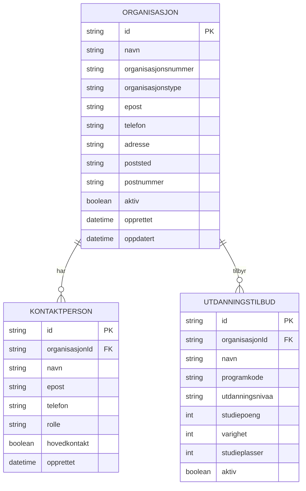

# Entity Map - Organisasjon

## Entitetsdiagram

## Entitetsbeskrivelser

### Organisasjon
**Formål**: Representerer utdanningsinstitusjoner som deltar i opptakssystemet

**Hovedegenskaper**:
- **navn**: Offisielt navn på organisasjonen
- **organisasjonsnummer**: Unikt juridisk identifikasjonsnummer
- **organisasjonstype**: Kategori (Universitet, Høgskole, Fagskole, Privat)
- **kontaktinformasjon**: E-post, telefon og adresse
- **aktiv**: Om organisasjonen er aktiv i systemet

### Kontaktperson
**Formål**: Kontaktpersoner for organisasjonen

**Hovedegenskaper**:
- **rolle**: Funksjon (Opptaksleder, Administrator, Saksbehandler)
- **hovedkontakt**: En person per organisasjon som hovedkontakt

### Utdanningstilbud
**Formål**: Utdanningstilbud som organisasjonen tilbyr

**Relasjon**: En organisasjon kan ha mange utdanningstilbud